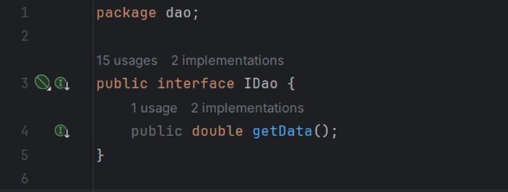
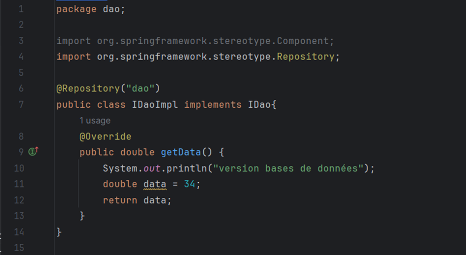
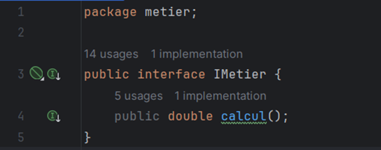
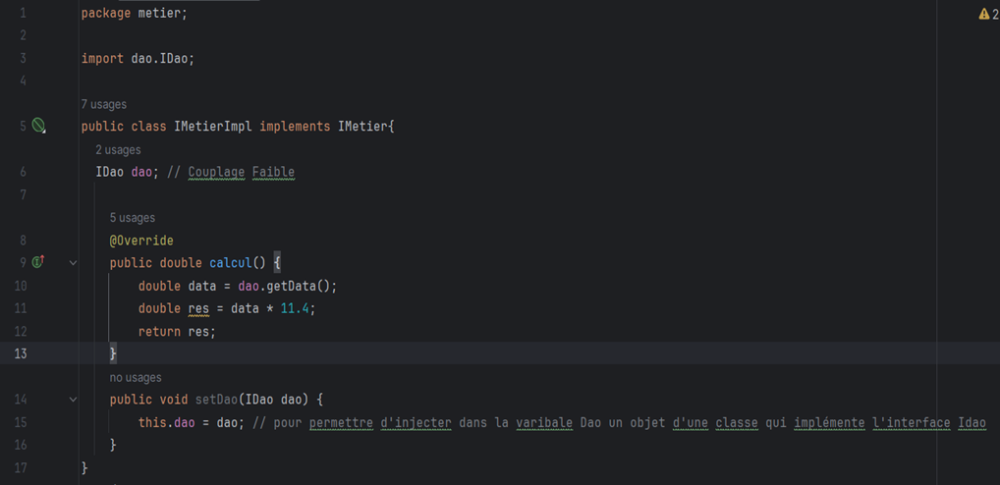
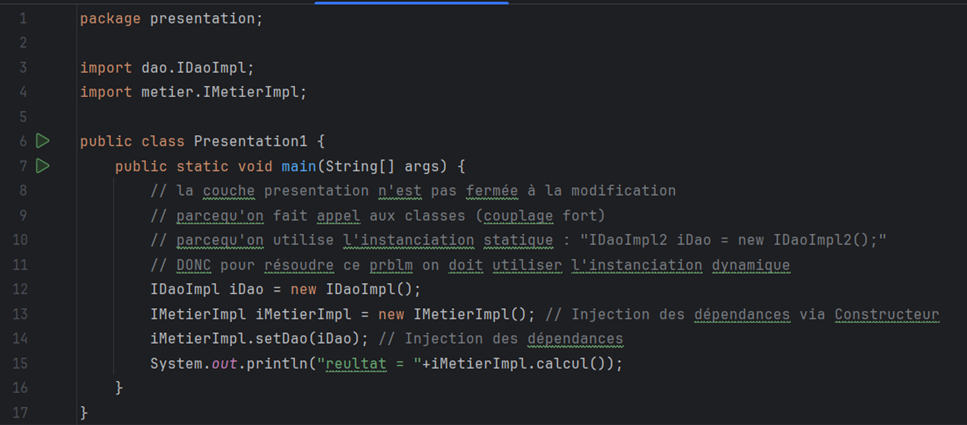
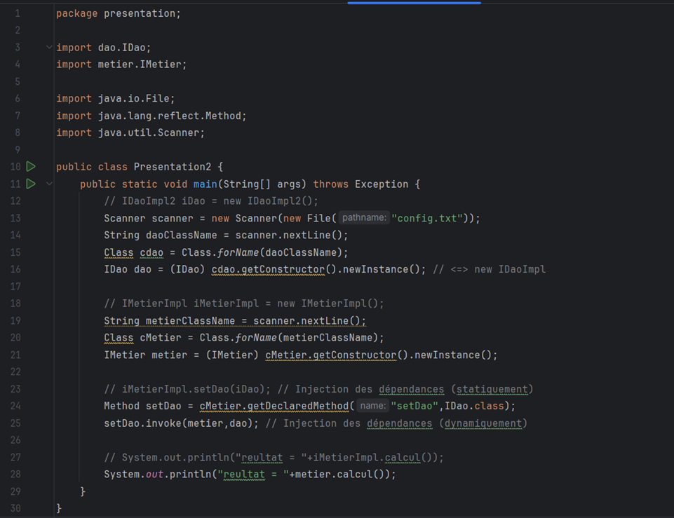
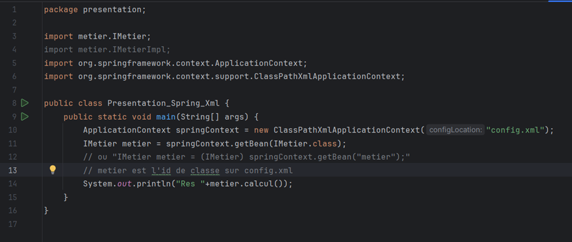
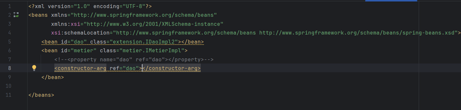
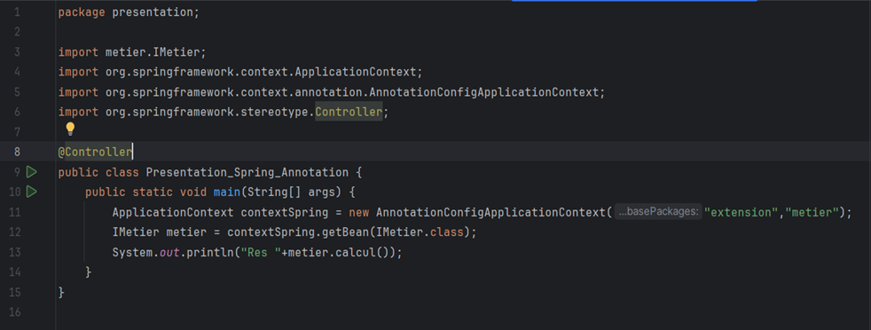

<h1 align="center">Compte Rendu (V1)</h1>
<h1 align="center">Inversion de Controle et Injection des Dépendances</h1>

<h2 style="text-decoration: underline" >Partie 1</h2>

<h3>1) Créer une interface IDao avec une méthode getData()</h3>

<h3>2) Créer une implémentation de cette interface</h3>

<h3>3) Créer l'interface IMetier avec une méthode calcul</h3>

<h3>4) Créer une implémentation de cette interface en utilisant le couplage faible</h3>

<h3>5) Faire l'injection des dépendances :</h3>
<h3>_a) Par Instanciation Statique_ :</h3>

<h3>_b) Par Instanciation Dynamique_ :</h3>

<h3>_c) En utilisant le Framework Spring_ :</h3>
<h3>_- Version XML_ :</h3>

<h4> Fichier "config.xml" :</h4>

<h3>_- Version ANNOTATIONS_ :</h3>

